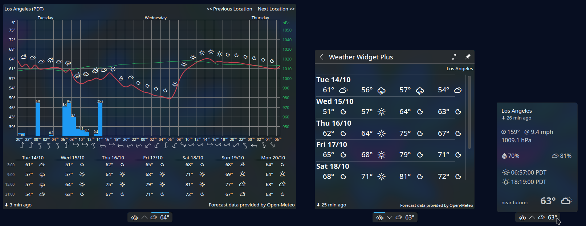
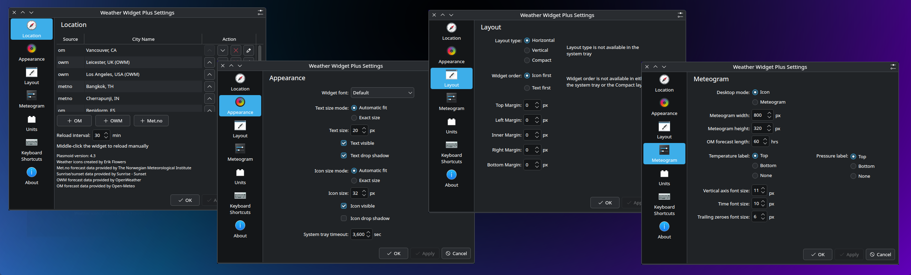

# Weather Widget Plus


Weather Widget Plus features a meteogram and extensive customization options. Data from OpenWeather and the Norwegian Meteorological Institute.

Weather Widget Plus is a plasmoid for KDE, and a fork of blackadderkate's [weather-widget-2](https://store.kde.org/p/1683743/), which was based on [plasma-applet-weather-widget](https://store.kde.org/p/998917) by Kotelnik/clearmartin.

Weather Widget Plus has vastly expanded appearance and layout settings and implements fixes for all open issues and pull requests of Weather Widget 2, so you can configure a pixel-perfect plasmoid for your panel. 

Many issues opened against Weather Widget 2 reference some visual glitch or an uncomfortable fit on the user's panel in some way - text that's too large or too small, oddly-sized margins, or uncooperative icons. The source of these problems was a lack of configuration options. The developer of Weather Widget 2 created a fairly responsive default that automatically fit typical usage, understood as the Breeze Plasma theme and Noto Sans font. But themes are fun, and lots of users, including myself, make changes to the defaults in some way. Without the ability to arbitrarily and exactly adjust margins or sizing, differences like a custom font, or creative panel usage, or any number of deviations from the development environment would cause the plasmoid to misbehave. 

Weather Widget Plus addresses this problem by putting the user in control with more configuration options. Enjoy the default settings or customize freely. Know your adjustments are exact.

The completely revised UI includes:

 - A new forecast data provider:
    - Open-Meteo is now the recommended provider
- New appearance options:
    - Choose your size mode: automatic fit or exact size
    - Icon or text can be hidden
    - Drop shadow is optional
    - All options, including size, can be applied to the text or the icon independently
- New layout options:
    - Top, left, right, bottom, and inner margins are adjustable
    - Widget order is adjustable: icon first or text first
    - Default positioning improved - complete rewrite, each layout adapts to all form factors
- New meteogram options:
    - Meteogram can be used as a desktop widget
    - Width and height are adjustable
    - Forecast length, when using Open-Meteo, is adjustable
    - Temperature axis is labeled
    - Axis label positions are adjustable
    - Precipitation label is decorated, and appears automatically in a fixed position
    - Font sizes are adjustable
- New unit options:
    - Precipitation can be displayed in millimeters or inches
- Tooltip improvements: 
    - Last refreshed time appears under location in the tooltip rather than on the widget itself
    - Tooltip properly hides when widget is expanded
- Quality of life improvements:
    - Properly uses system font by default
    - Properly uses system icon theme (No hard-coded custom icon)
    - Properly uses system color scheme (No hard-coded colors)
    - Add Location dialog has proper window decoration
    - Compatibility with transparent themes
    - Weather icons font improved: certain glyphs have been centered (instead of sitting below the middle like a lowercase letter)
    - Configuration page formatting improved: easier to use, easier to read, easier to translate

Pull or merge requests to update translations are especially welcome





## Installation
### KDE Store/Pling:

[https://store.kde.org/p/2281196](https://store.kde.org/p/2281196)

### Discover:

Right click on the panel/desktop -> Add or Manage Widgets... -> Get New... -> Download New Plasma Widgets -> Search for Weather Widget Plus -> Download -> Add to a panel or the desktop

#### GitHub CLI:

`git clone https://github.com/tully-t/weather-widget-plus`

`cd weather-widget-plus`

`cp -r weather.widget.plus/ ~/.local/share/plasma/plasmoids/weather.widget.plus`

#### GitHub GUI:

- Download and extract weather-widget-plus.zip

then

- From the panel context menu or Desktop Edit Mode: Add or Manage Widgets... -> Get New... -> Install Widget From Local File...-> use the file dialog that appears to find and select weather.widget.plus.plasmoid

or

- Copy the weather.widget.plus folder to ~/.local/share/plasma/plasmoids

## Using Weather Widget Plus in the System Tray:
For a newly installed plasmoid to appear as a System Tray entry, it is necessary to log out and log back in or restart plasmashell

As a System Tray entry, Weather Widget Plus may only respond to Location changes after you log out and log back in or restart plasmashell. This unintended behavior is currently under investigation

## Notes
The integrated Met.no search function may return in the future. For now, use [Geonames.org](https://www.geonames.org/) to find the latitude, longitude, and altitude for your location.

With an update from Plasma 5 to Plasma 6, users may encounter the following error:
```
file:///~/.local/share/plasma/plasmoids/weather.widget.plus/contents/ui/main.qml:55:5: Type OpenWeatherMap unavailable 
file:///~/.local/share/plasma/plasmoids/weather.widget.plus/contents/ui/providers/OpenWeatherMap.qml:18:1: module "QtQml.XmlListModel" is not installed
```

The missing package is [qml6-module-qtqml-xmllistmodel](https://packages.debian.org/sid/qml6-module-qtqml-xmllistmodel) (Debian) / [qt5-xmlpatterns](https://archlinux.org/packages/extra/x86_64/qt5-xmlpatterns/) (Arch) / [qt5-qtxmlpatterns](https://packages.fedoraproject.org/pkgs/qt5-qtxmlpatterns/qt5-qtxmlpatterns/) (Fedora). Installation instructions for this package are below: 
Debian: $ sudo apt install qml6-module-qtqml-xmllistmodel 
Arch Linux: $ sudo pacman -S qt5-declarative $ sudo pacman -S qt5-xmlpatterns 
Fedora: $ sudo dnf install qt5-qtxmlpatterns 
After installation, restart or log out and log back in.

### Contributing
Start a discussion to propose new features or ask questions!

Please open an issue if you notice any bugs, errors, or unexpected behavior.

Pull or merge requests are appreciated.

### License

This project is licensed under the GNU GPL v2 - see the [LICENSE.md](LICENSE.md) file for details.

### Acknowledgements
As noted in the intro, this plasmoid is a fork of [Weather Widget 2](https://github.com/blackadderkate/weather-widget-2) by [blackadderkate](https://github.com/blackadderkate) which is based on [Weather Widget](https://github.com/kotelnik/plasma-applet-weather-widget) by [Kotelnik](https://github.com/kotelnik).

